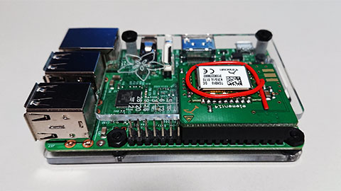

node-enocean-utils
===============

The node-enocean-utils is a Node.js module which allows you to get and analyze telegrams came from EnOcean devices via a gateway such as USB [300](https://www.enocean.com/en/enocean_modules/usb-300-oem/)/[300U](https://www.enocean.com/en/enocean_modules_902mhz/usb-300u-oem/)/[400J](https://www.enocean.com/en/enocean_modules_928mhz/usb-400j/) or [EnOcean Pi](https://www.element14.com/community/docs/DOC-55169/l/enocean-pi-transforms-raspberry-pi-into-a-wireless-gateway).

This module is based on the EnOcean specification as follows:

- EnOcean Serial Protocol 3 (ESP3)
- EnOcean Radio Protocol 2 (ERP2)
- EnOcean Radio Protocol 1  (ERP1)
- EnOcean Equipment Profiles (EEP) 2.6.5

See the [EnOcean web site](https://www.enocean.com/en/knowledge-base/) for details.

## Dependencies

- [Node.js](https://nodejs.org/en/) 4.4 +
  - Though the node-enocean-utils works on Node 4 for now, it is strongly recommended to use Node 6 or newer. The node-enocean-utils will not support Node 4 in the future.
- [serialport](https://www.npmjs.com/package/serialport) 5.0.0 +
  - If the serialport module has been already installed in you host computer, check the version. The node-enocean-utils now does not support older versions than 5.0.0 of the serialport module.

## Installation

```
$ cd ~
$ npm install serialport
$ npm install node-enocean-utils
```

---------------------------------------
## Table of Contents

* [Quick Start](#Quick-Start)
* [Methods](#Methods)
  * [`teach()`](#teach-method)
  * [`getDeviceInfo()`](#getDeviceInfo-method)
  * [`getLearnedDevices()`](#getLearnedDevices-method)
  * [`startMonitor()`](#startMonitor-method)
  * [`stopMonitor()`](#stopMonitor-method)
  * [`emulateIncomingTelegram()`](#emulateIncomingTelegram-method)
* [Events](#Events)
  * [`data` event](#data-event)
  * [`data-known` event](#data-known-event)
  * [`data-unknown` event](#data-unknown-event)
  * [`data-learn` event](#data-learn-event)
* [Objects](#Objects)
  * [`EnoceanUtils` object](#EnoceanUtils-object)
  * [`Gateway` object](#Gateway-object)
  * [`Device` object](#Device-object)
  * [`Telegram` object](#Telegram-object)
  * [`Message` object](#Message-object)
  * [`Value` object](#Value-object)
* [Supported EEPs](#Supported-EEPs)
* [Command Line Tools](#Command-Line-Tools)
  * [analyzer.js](#analyzer-js)
  * [learn.js](#learn-js)
* [How to know the module ID and the EEP](#How-to-know)
* [How to create your custom EEP parser](#How-to-create)
* [How to use an EnOcean Pi](#How-to-use-an-EnOcean-Pi)
* [Release Note](#Release-Note)
* [License](#License)

---------------------------------------
## <a id="Quick-Start">Quick Start</a>

```JavaScript
const enocean = require('node-enocean-utils');

// Teach the information of Enocean devices
enocean.teach({
  'id'  : '00 00 00 2C 86 5C',
  'eep' : 'F6-02-04',
  'name': 'ESM210R Rocker Switch Single'
});
enocean.teach({
  'id'  : '00 00 04 01 31 95',
  'eep' : 'A5-02-05',
  'name': 'STM 431J Temperature Sensor'
});

// Start to monitor telegrams incoming from the Enocean devices
enocean.startMonitor().then(() => {
  // Set an event listener for 'data-known' events
  enocean.on('data-known', (telegram) => {
    let message = telegram['message'];
    console.log(message['device']['name'] + ': ' + message['desc']);
  });
}).catch((error) => {
  console.error(error);
});
```

At first, the information of a Rocker switch and a Temperature sensor is set using [`teach()`](#teach-method) method. In this case, the information of a device consists of 3 properties. The `id` property is a module ID of the targeted device. The `eep` property is an EEP (EnOcean Equipment Profile) which the targeted device supports. The `name` property is a name of the targeted device.

Then the [`startMonitor()`](#startMonitor-method) method is called to start monitoring telegrams incoming from the targeted devices. The [`startMonitor()`](#startMonitor-method) method returns a `Promise` object.

Finally, an event listener for the [`data-known`](#data-known-event) event is set in this case. The [`data-known`](#data-known-event) event will be fired only if the received telegram came from the devices which you registered using the [`teach()`](#teach-method) method and the registered EEP for the device was supported by this Node.js module `node-enocean-utils`. You can see the supported EEPs in the section "[Supported EEPs](#Supported-EEPs)" below.

When the [`data-known`](#data-known-event) event is fired, a [`Telegram`](#Telegram-object) object will be passed to the callback function. The [`Telegram`](#Telegram-object) object contains many values parsed from the incoming telegram. The sample code above shows the device name and the report data detected by the device.

You will see the result like this:

```
ESM210R Rocker Switch Single: B0 pressed
ESM210R Rocker Switch Single: B0 released
ESM210R Rocker Switch Single: BI pressed
ESM210R Rocker Switch Single: BI released
STM 431J Temperature Sensor: 28.2℃
STM 431J Temperature Sensor: 28.4℃
```

In order to analyze the EEP-specific reports in telegrams incoming from EnOcean devices, you have to know at least the module ID and the EEP of the targeted device in advance.

Using the "Teach-In" mechanism of EnOcean, you could get the module ID and the EEP by yourself. See the section "[How to know the module ID and the EEP](#How-to-know)" for details. At least you can surely obtain the module ID by yourself. But you can not necessarily obtain the EEP of all devices. If you don't know the EEP of your own device, check the user manual of the device or ask the seller which sold it to you.

---------------------------------------
## <a id="Methods">Methods</a>

### <a id="teach-method">teach(*device*)</a>

This method resisters a device. The [Device](#Device-object) object must be passed as the 1st argument. See the section "[Device object](#Device-object)" in details for the [`Device`](#Device-object) object.

```JavaScript
const enocean = require('node-enocean-utils');
enocean.teach({
  'id'  : '00 00 04 01 2B B4',
  'eep' : 'A5-07-01',
  'name': 'HM92-01WHC motion detector'
});
```

### <a id="getDeviceInfo-method">getDeviceInfo(*id*)</a>

This method returns a [`Device`](#Device-object) object identified by the specified `id` among the registered devices using the [`teach()`](#teach-method) method.

The value of `id` must be a module ID of an EnOcean device. It must be hexadecimal representation such as `00 00 00 2C 86 5C`. `0000002C865C` and `00-00-00-2C-86-5C` are also acceptable. The value is not case-sensitive.

The module ID specified in EnOcean specifications consists of 24 bit, 32 bit, 48 bit. Therefore the value of `id` must be 6, 8, or 12 hexadecimal characters without white-space characters and hyphen characters.

If no device was found, then `null` will be returned.

```JavaScript
const enocean = require('node-enocean-utils');
enocean.teach({
  'id'  : '00 00 04 00 8F E0',
  'eep' : 'D5-00-01',
  'name': 'STM250J Door Sensor'
});
let device = enocean.getDeviceInfo('00 00 04 01 2B B4');
console.log(device['id']);
console.log(device['name']);
```

The result of the sample code above will be as follows:

```
000004008FE0
STM250J Door Sensor
```

Note that the module ID in the result is slightly different from the `id` passed to [`teach()`](#teach-method) method. All module ID are normalized to the same format internally.

### <a id="getLearnedDevices-method">getLearnedDevices()</a>

This method returns all of the registered devices as an hash object. The key of the hash object is a normalized module ID of a device.

```JavaScript
const enocean = require('node-enocean-utils');

enocean.teach({
  'id'  : '00 00 04 00 8F E0',
  'eep' : 'D5-00-01',
  'name': 'STM250J Door Sensor'
});
enocean.teach({
  'id'  : '00 00 04 01 2B B4',
  'eep' : 'A5-07-01',
  'name': 'HM92-01WHC motion detector'
});
enocean.teach({
  'id'  : '00 00 04 01 31 95',
  'eep' : 'A5-02-05',
  'name': 'STM 431J Temperature Sensor'
});

let devices = enocean.getLearnedDevices();
for(let id in devices) {
  let device = devices[id];
  let cols = [device['id'], device['eep'], device['name']];
  console.log(cols.join(' | '));
}
```

The result of the sample code above will be as follows:

```
000004008FE0 | D5-00-01 | STM250J Door Sensor
000004012BB4 | A5-07-01 | HM92-01WHC motion detector
000004013195 | A5-02-05 | STM 431J Temperature Sensor
```

### <a id="startMonitor-method">startMonitor(*[params[, callback]]*)</a>

This method establishes a connection to a USB serial port associated to your USB gateway dongle and starts to monitor telegrams coming from EnOcean devices. This method returns a `Promise` object by default.

```JavaScript
enocean.startMonitor().then((gateway) => {
  // Found a serial port and started to monitor successfully.
  // Show the details of the found gateway
  onsole.log(JSON.stringify(gateway, null, '  '));
}).catch((error) => {
  // Failed to find a serial port or failed to start to monitor.
});
```

If this method is executed successfuly, a [`Gateway`](#Gateway-object) object containing information of the found gateway will be passed to the `resolve()` function. 

You can pass two arguments optionally. The 1st argument must be a hash object containing the properties as follows:

Property | Type   | Required | Description
---------|--------|----------|------------
`path`   | String | optional | The path of the USB gateway. If you use Windows OS, it should be like `COM3`. If you use Linux, it should be like `/dev/tty-usbserial1`.
`rate`   | Number | optional | The baud rate of the USB gateway. The default value of the `rate` property is 56700. If your USB gateway supports the default baud rate, you don't need to specify the property.

Basically, you don't have to pass the 1st argument to this method because this method automatically detects the USB serial port associated to your USB gateway. Specify the argument only if the auto-detection failed in your host computer environment.

The 2nd argument must be a callback function. Note that the 2nd argument is only for backward-compatibility with old versions of this module. Never specify the 2nd argument to this method now. The callback style will be deprecated in the future.

```JavaScript
enocean.startMonitor({'path': 'COM7', 'rate': 57600}, (error) => {
  // This is an old-fashioned coding style.
  // Never do this.
});
```

### <a id="stopMonitor-method">stopMonitor(*[callback]*)</a>

This method stops monitoring incoming telegrams. This method returns a `Promise` object by default.

```JavaScript
enocean.stopMonitor().then(() => {
  console.log('Stopped monitoring successfully.');
}).catch((error) => {
  console.error(error);
});
```

You can pass a callback function as the 1st argument to this mothod. Note that the 1st argument is only for backward-compatibility with old versions of this module. Never pass the 1st argument to this method. The callback style will be deprecated in the future.

```JavaScript
enocean.stopMonitor((error) => {
  // This is an old-fashioned coding style.
  // Never do this.
});
```

### <a id="emulateIncomingTelegram-method">emulateIncomingTelegram(*telegram*)</a>

This method emulates an incoming telegram mainly for debug. Calling this method with a hex data representing a telegram, this module acts as if the telegram is received via the USB gateway. This method returns nothing.

Note that your USB gateway has to be accessible via a serial port to use this method.

```javascript
// Start to monitor telegrams incoming from the Enocean devices
enocean.startMonitor().then((gateway) => {
  // Set an event listener for 'data-known' events
  enocean.on('data', (telegram) => {
    console.log(JSON.stringify(telegram.message, null, '  '));
  });
  // A hex string representing a telegram
  let hex = '55 00 0A 07 01 EB A5 00 00 5F 08 01 80 BA 56 00 01 FF FF FF FF 37 00 BE';
  // Emulate an incoming telegram
  enocean.emulateIncomingTelegram(hex);
}).catch((error) => {
  console.error(error);
});
```

---------------------------------------
## <a id="Events">Events</a>

Whenever an EnOcean telegram was received, an event will be fired on the [`EnoceanUtils`](#EnoceanUtils-object) object.

### <a id="data-event">`data` event</a>

The `data` event will be fired whenever any telegram was received event even if the telegram was not able to be parsed (The EEP was not supported by this module) or the telegram was a Teach-In telegram.

### <a id="data-known-event">`data-known` event</a>

The `data-known` event will be fired only if the received telegram came from the devices which you registered using the `teach()` method and the registered EEP for the device was supported by this module.

### <a id="data-unknown-event">`data-unknown` event</a>

The `data-unknown` event will be fired only if the received telegram was not able to be parsed (The module ID of the originator device was not registered or the EEP was not supported by this module).

### <a id="data-learn-event">`data-learn` event</a>

The `data-learn` event will be fired when the received telegram was a Teach-In telegram.

---------------------------------------
## <a id="Objects">Objects</a>

### <a id="EnoceanUtils-object">`EnoceanUtils` object</a>

The `EnoceanUtils` object can be obtain by the code below as you can see the previous sections many times.

```JavaScript
var enocean = require('node-enocean-utils');
```

As you know, this document explain how to use the `EnoceanUtils` object.

### <a id="Gateway-object">`Gateway` object</a>

The `Gateway` object represents an USB gateway dongle such as USB [300](https://www.enocean.com/en/enocean_modules/usb-300-oem/)/[300U](https://www.enocean.com/en/enocean_modules_902mhz/usb-300u-oem/)/[400J](https://www.enocean.com/en/enocean_modules_928mhz/usb-400j/). This object is just a hash object.

This object consists of the properties as follows:

Property         | Type   | Description
:----------------|:-------|:------------
`path`           | String | The identifier of the serial port. (e.g., `"/dev/ttyUSB0"`, `"COM7"`)
`baudRate`       | Number | The baud rate. (e.g., `57600`)
`manufacturer`   | String | The manufacturer of the USB gateway dongle or the USB serial chip in the USB gateway dongle. (e.g., `"EnOcean GmbH"`, `"FTDI"`)
`vendorId`       | String | The vendor ID of the USB serial chip in the USB gateway dongle. (e.g., `"0403"`)
`productId`      | String | The product ID of the USB serial chip in the USB gateway dongle or the name of the USB gateway dongle. (e.g., `"6001"`, `"EnOcean USB 400J DA"`)
`serialNumber`   | String | The serial number of the USB serial chip in the USB gateway dongle. (e.g., `"FT5CTUI"`)
`appVersion`     | String | The application version of the USB gateway dongle. (e.g., `"1.3.0.0"`)
`chipId`         | String | The chip ID of the USB gateway dongle. (e.g., `"04014979"`)
`chipVersion`    | String | The chip version of the USB gateway dongle. (e.g., `"69.79.4.0"`)
`appDescription` | String | The application description of the USB gateway dongle. (e.g., `"DolphinV4_GWC"`)

The meanings of the `manufacturer`, `vendorId`, `productId`, and `serialNumber` properties depend on the OS. On the other hand, the meanings of the `appVersion`, `chipId`, `chipVersion`, and `appDescription` properties are consistent on any OSes because they are obtained from the USB gateway dongle.

#### Linux:

```JavaScript
{
  "path": "/dev/ttyUSB0",
  "baudRate": 57600,
  "manufacturer": "EnOcean GmbH",
  "vendorId": "0403",
  "productId": "EnOcean USB 400J DA",
  "serialNumber": "FT5CTUI",
  "appVersion": "1.3.0.0",
  "apiVersion": "1.4.4.0",
  "chipId": "04014979",
  "chipVersion": "69.79.4.0",
  "appDescription": "DolphinV4_GWC"
}
```

#### Mac OS X:

```JavaScript
{
  "path": "/dev/tty.usbserial-FT5CTUI",
  "baudRate": 57600,
  "manufacturer": "EnOcean GmbH",
  "vendorId": "0403",
  "productId": "6001",
  "serialNumber": "FT5CTUI",
  "appVersion": "1.3.0.0",
  "apiVersion": "1.4.4.0",
  "chipId": "04014979",
  "chipVersion": "69.79.4.0",
  "appDescription": "DolphinV4_GWC"
}
```

#### Windows:

```JavaScript
{
  "path": "COM7",
  "baudRate": 57600,
  "manufacturer": "FTDI",
  "vendorId": "0403",
  "productId": "6001",
  "serialNumber": "FT5CTUIA",
  "appVersion": "1.3.0.0",
  "apiVersion": "1.4.4.0",
  "chipId": "04014979",
  "chipVersion": "69.79.4.0",
  "appDescription": "DolphinV4_GWC"
}
```

### <a id="Device-object">`Device` object</a>

The `Device` object represents an EnOcean device. This object is just a hash object.

When you use the [`teach`](#teach-method) method, you have to create this object by yourself. When you use the [`getDeviceInfo()`](#getDeviceInfo-method) method or the [`getLearnedDevices()`](#getLearnedDevices-method) method, you can obtain this object. You can see this object in the [`Telegram`](#Telegram-object) object as well.

This object consists of the properties as follows. The columns named "Required" is for the 1st argument of the [`teach()`](#teach-method) method:

Property      | Type   | Required | Description
--------------|--------|----------|------------------
`id`          | String | required | The module ID of the device. The value must be a string. (e.g. "00 00 00 2C 86 5C")
`eep`         | String | required | The EEP which the device supports. The value must be a string. (e.g. "F6-02-04")
`name`        | String | optional | The name of the device which you can identify the device. The value is not used for any process in this module. You can set any name. The length of the value must be equal to or less than 50.
`manufacturer`| String | optional | The manufacturer name of the device. The value is not used for any process. You can set any name. The length of the value must be equal to or less than 50.

### <a id="Telegram-object">`Telegram` object</a>

The `Telegram` object represents an EnOcean telegram. This object is just a hash object.

Whenever an EnOcean telegram is received, an `Telegram` object will be passed to the callback function for the relevant event as the 1st argument. The structure of the `Telegram` object is as follows:

Property          | Type    | Description
------------------|---------|------------
`message`         | [`Message`](#Message-object) | See the section "[`Message` object](#Message-object)"
`buffer`          | Buffer  | This Buffer object represents a whole extent of the telegram.
`hex`             | Array   | This array represents a whole extent of the telegram. Each element in the array is an hexadecimal representation of each byte.
`structure`       | Array   | This array is used for [`analyzer.js`](#analyzer-js). You probably don't need this array. If you are interested in this array, you can see the structure using `console.dir()`.

Though there are a lot of values in this object, you don't need to use all values. It is enough to know only the `message` property in this object. You can get a [`Message`](#Message-object) object through the `message` property. See the section "[`Message` object](#Message-object)" for details.

### <a id="Message-object">`Message` object</a>

You can obtain most of the necessary values through The `message` property in the [`Telegram`](#Telegram-object) object. The `message` property in this object returns a hash object having the properties as follows:

Property          | Type    | Description
------------------|---------|------------
`packet_type`     | Number  | The code of the packet type. You can see the meaning of this value from the `packet_type_desc` property.
`packet_type_desc`| String  | The pakcet type.
`device`          | Object  |The [`Device`](#Device-object) object representing the originated device.
`oid`             | String  | The module ID of the originated device. This value is not normalized.
`crc`             | Boolean | The result of all of the CRC8 checks specified in EnOcean Serial Protocol 3 (ESP3) specification. If all of the CRC8 checks were passed, the value of this property will be true, otherwise false.
`eep`             | String  | The EEP of the telegram.
`known`           | Boolean | If the originated device was registered and the EEP was supported by this module, this value will be true, otherwise false.
`value`           | Object  | The [`Value`](#Value-object) representing the EEP-specific report from the originated device. This value is an hash object. The properties in the object depends on the EEP. See the section "[Value] object](#Value-object)" and the section "[Supported EEPs](#Supported-EEPs)" in details.
`desc`            | String  | This value represents the report from the originated device. This value is a string summarizing the report.
`learn`           | Boolean | When the telegram is a Teach-In telegram, this value will be true, otherwise false.
`rorg`            | Number  | The R-ORG part in the EEP.
`rorg_desc`       | String  | The meaning of the R-ORG.
`func`            | Number  | The FUNC part in the EEP.
`func_desc`       | String  | The meaning of the FUNC.
`type`            | Number  | The TYPE part in the EEP.
`type_desc`       | String  | The meaning of the TYPE.
`dbm`             | Number  | The RSSI value. The unit is dBm.
`dbm_desc`        | String  | The RSSI with the unit.
`data_dl_buffer`  | Buffer  | A Buffer object representing the Data DL.

```JavaScript
var enocean = require('node-enocean-utils');

enocean.teach({
  'id'  : '00 00 04 01 31 95',
  'eep' : 'A5-02-05',
  'name': 'STM 431J Temperature Sensor'
});

enocean.startMonitor({'path': 'COM7', 'rate': 57600});

enocean.on('data-known', (telegram) => {
  console.dir(telegram['message']);
});
```

The result of the code above will be as follows:

```JavaScript
{ packet_type: 10,
  packet_type_desc: 'RADIO_ERP2 (ERP2 protocol radio telegram)',
  device:
   { id: '000004013195',
     eep: 'A5-02-05',
     name: 'STM 431J Temperature Sensor',
     manufacturer: '',
     learned: true },
  oid: '04 01 31 95',
  crc: true,
  eep: 'A5-02-05',
  known: true,
  value: { temperature: '28.7' },
  desc: '28.7℃',
  learn: false,
  rorg: 'A5',
  rorg_desc: '4BS Telegram',
  func: '02',
  func_desc: 'Temperature Sensors',
  type: '05',
  type_desc: 'Temperature Sensor Range 0℃ to +40℃',
  dbm: -41,
  dbm_desc: '-41 dBm' }
```

### <a id="Value-object">`Value` object</a>

You can obtain the EEP-specific report from the `Value` object which you can access through the `value` property in the [`Telegram`](#Telegram-object). The sample code below shows how to obtain and utilize the `Value` object.

```JavaScript
var enocean = require('node-enocean-utils');

enocean.teach({
  'id'  : '00 00 04 00 8F E0',
  'eep' : 'D5-00-01',
  'name': 'STM250J Door Sensor'
});

enocean.teach({
  'id'  : '00 00 00 2C 86 5C',
  'eep' : 'F6-02-04',
  'name': 'ESM210R Rocker Switch Single'
});

enocean.startMonitor({'path': 'COM7', 'rate': 57600});

enocean.on('data-known', (telegram) => {
  var value = telegram['message']['value']; // Value object
  var eep = telegram['message']['eep'];
  if(eep === 'D5-00-01') {
    // STM250J Door Sensor
    if(value['contact'] === 1) {
      console.log('The door was closed.');
    } else if(value['contact'] === 0) {
      console.log('The door was opened.');
    }
  } else if(eep === 'F6-02-04') {
    // ESM210R Rocker Switch Single
    if(value['pressed'] === 1) {
      console.log(value['button'] + ' was pressed.');
    } else if(value['pressed'] === 0) {
      console.log(value['button'] + ' was released.');
    }
  }
});
```
The two type of devices are registered, a door sensor and a rocker switch. In the callback function for the `data-known` event, the EEP is determined from `Telegram.message.eep` property. As you can see, the properties supported by the `Value` object are different depending on the EEP. See the section "[Supported EEPs](#Supported-EEPs)" for details.

---------------------------------------
## <a id="Supported-EEPs">Supported EEPs</a>

This module supports the EEPs as follows. This section describes the structure of the `Value` object for each EEP as well.

### A5-02-05

* RORG : 4BS Telegram (A5)
* FUNC : Temperature Sensors (02)
* TYPE : Temperature Sensor Range 0°C to +40°C (05)

Property      | Type   | Description
--------------|--------|------------
`temperature` | Number | This value is the temperature measured by the originated temperature sensor. The unit is Celsius (℃).

### A5-04-01

* RORG : 4BS Telegram (A5)
* FUNC : Temperature and Humidity Sensor (04)
* TYPE : Range 0°C to +40°C and 0% to 100% (01)

Property       | Type   | Description
---------------|--------|------------
`humidity`     | Number | This value is the humidity measured by the originated sensor. The unit is percent (%).
`temperature`  | Number | This value is the temperature measured by the originated temperature sensor. The unit is Celsius (℃). If the originated sensor does not have temperature sensor availability, this value is null.

### A5-05-01

* RORG : 4BS Telegram (A5)
* FUNC : Barometric Sensor (05)
* TYPE : Range 500 to 1150 hPa (01)

Property      | Type   | Description
--------------|--------|------------
`bar`         | Number | This value is the barometric pressure. The unit is hPa.
`ttp`         | Number | This value represents the telegram type. The value `0` means "Heartbeart". The value `1` means "Event triggered".

### A5-06-02

* RORG : 4BS Telegram (A5)
* FUNC : Light Sensor (06)
* TYPE : Range 0lx to 1020lx (02)

Property      | Type   | Description
--------------|--------|------------
`ill`         | Number | This value is the illumination measured by the originated sensor. The unit is lx.
`svc`         | Number | This value represents the supply voltage. This value is a floating number between 0 and 5. The unit is V.

### A5-07-01

* RORG : 4BS Telegram (A5)
* FUNC : Occupancy Sensor (07)
* TYPE : Occupancy with Supply voltage monitor (01)

Property      | Type   | Description
--------------|--------|------------
`pirs`        | Number | This value represents the PIR status. If the occupancy sensor detect any motion, this value will be 1, otherwise 0.
`svc`         | Number | This value represents the supply voltage. This value is a floating number between 0 and 5. The unit is V.

### A5-09-04

* RORG : 4BS Telegram (A5)
* FUNC : Gas Sensor (09)
* TYPE : CO2 Sensor (04)

Property       | Type   | Description
---------------|--------|------------
`humidity`     | Number | This value is the humidity measured by the originated sensor. The unit is percent (%). If the originated sensor does not have humidity sensor availability, this value is null.
`concentration`| Number | This value is the CO2 concentration measured by the originated sensor. The unit is ppm.
`temperature`  | Number | This value is the temperature measured by the originated temperature sensor. The unit is Celsius (℃). If the originated sensor does not have temperature sensor availability, this value is null.

### D5-00-01

* RORG : 1BS Telegram (D5)
* FUNC : Contacts and Switches (00)
* TYPE : Single Input Contact (01)

Property      | Type   | Description
--------------|--------|------------
`contact`     | Number | This value will be 1 if the door was closed. Otherwise it will be 0.

### F6-02-01

* RORG : RPS Telegram (F6)
* FUNC : Rocker Switch, 2 Rocker (02)
* TYPE : Light and Blind Control - Application Style 1 (01)

Property  | Type   | Description
----------|--------|------------
`pressed` | Number | If a button was pressed, this value will be 1. If a button was released, this value will be 0.
`button`  | String | The button name which was pressed or released. This value is either 'BI', 'B0', 'AI', or 'A0'.

### F6-02-02

* RORG : RPS Telegram (F6)
* FUNC : Rocker Switch, 2 Rocker (02)
* TYPE : Light and Blind Control - Application Style 2 (02)

Property  | Type   | Description
----------|--------|------------
`pressed` | Number | If a button was pressed, this value will be 1. If a button was released, this value will be 0.
`button`  | String | The button name which was pressed or released. This value is either 'BI', 'B0', 'AI', or 'A0'.

### F6-02-04

* RORG : RPS Telegram (F6)
* FUNC : Rocker Switch, 2 Rocker (02)
* TYPE : Light and blind control ERP2 (04)

Property  | Type   | Description
----------|--------|------------
`pressed` | Number | If a button was pressed, this value will be 1. If a button was released, this value will be 0.
`button`  | String | The button name which was pressed or released. This value is either 'BI', 'B0', 'AI', or 'A0'.


### D2-32-02

* RORG : VLD Telegram (D2)
* FUNC : A.C. Current Clamp (32)
* TYPE : Type 0x02 (02)

Property  | Type    | Description
:---------|:--------|:------------
`fail`    | Boolean | Power Fail.
`ch1`     | Number  | Current value of the channel 1. The unit is "A" (ampere).
`ch2`     | Number  | Current value of the channel 2. The unit is "A" (ampere).
`ch3`     | Number  | Current value of the channel 3. The unit is "A" (ampere).


---------------------------------------
## <a id="Command-Line-Tools">Command Line Tools</a>

This module includes some useful command line scripts in `tools` folder.

### <a id="analyzer-js">analyzer.js</a>

This script analyzes all incoming telegrams and shows you the results as formatted texts. If you want to analyze EEP-specific telegrams, set the device information as an array to the `analyzer.json` located in the same folder. The JSON blow is an example of `analyzer.json`:

```JavaScript
[
  {
    "id"  : "00 00 04 00 8F E0",
    "eep" : "D5-00-01",
    "name": "STM250J Door Sensor"
  },
  {
    "id"  : "00 00 04 01 31 95",
    "eep" : "A5-02-05",
    "name": "STM 431J Temperature Sensor"
  }
]
```

If you run this script, this script listens to incoming telegrams. Whenever an telegram comes, this script shows the result.

This script takes two arguments. The 1st argument is the path of the serial port. The 1st argument is optional. If you don't specify the 1st argument, the path of the serial port will be detected automatically. The 2nd argument is the baud rate of the serial port. The 2nd argument is optional as well. If you don't specify the 2nd argument, the baud rate is 56700.

This script shows the result as follows:

```
D:\GitHub\node-enocean-utils\tools>node analyzer.js COM7
===============================================================================
[Summary]
- HEX                          |55 00 0A 02 0A 9B 22 04 01 31 95 00 00 48 08..
- Packet Type                  |RADIO_ERP2 (ERP2 protocol radio telegram)
- Device Name                  |STM 431J Temperature Sensor
- Device ID                    |000004013195
- Manufacturer                 |Unknown
- EEP                          |A5-02-05
- RORG                         |4BS Telegram
- FUNC                         |Temperature Sensors
- TYPE                         |Temperature Sensor Range 0℃ to +40℃
- Data                         |28.7℃
- Learn                        |false
- Known                        |true
- RSSI                         |-41 dBm
- CRC                          |valid
-------------------------------------------------------------------------------
[Telegram]
- Sync. Byte                   |55         |55
- Header                       |00 0A 02 0A|
  - Data Length                |00 0A      |10 byte
  - Optional Length            |02         |2 byte
  - Packet Type                |0A         |RADIO_ERP2 (ERP2 protocol radio ..
- CRC8H                        |9B         |valid
- Data                         |22 04 01 31|
  - Header                     |22         |
    - Address Control          |01         |Originator-ID 32 bit; no Destina..
    - Extended header available|00         |No extended header
    - Telegram type (R-ORG)    |02         |4BS telegram (0xA5)
  - Originator-ID              |04 01 31 95|04 01 31 95
  - Data_DL                    |00 00 48 08|
    - Temperature              |48         |28.7℃
    - LRN Bit                  |01         |Data telegram
  - CRC                        |63         |valid
- Optional Data                |01 29      |
  - SubTelNum                  |01         |1
  - dBm                        |29         |-41 dBm
- CRC8D                        |CA         |valid
```

### <a id="learn-js">learn.js</a>

This script analyzes incoming Teach-In telegrams and shows you the results. If you run this script, this script listens to incoming Teach-In telegrams. Whenever an Teach-In telegram comes, this script shows the result.

This script takes two arguments. The 1st argument is the path of the serial port. The 1st argument is optional. If you don't specify the 1st argument, the path of the serial port will be detected automatically. The 2nd argument is the baud rate of the serial port. The 2nd argument is optional as well. If you don't specify the 2nd argument, the baud rate is 56700.

This script shows the result as follows:

```
D:\GitHub\node-enocean-utils\tools>node learn.js COM7
Module ID   |EEP     |Manufacturer
------------|--------|--------------------
000004012BB4|A5-07-81|SIMICX_CO_LTD
000004013195|A5-02-05|ENOCEAN_GMBH
000004008FE0|        |
```

---------------------------------------
## <a id="How-to-know">How to know the module ID and the EEP</a>

In order to know the module ID and the EEP, read the user manual of the device you own at first if it is available. If it does not describe such information, you can investigate the information by yourself depending on the type of the device.

The devices sending telegrams grouped in 4BS (e.g. temperature sensors) or 1BS (e.g. door sensors) are probably equipped with a small button. If you press the button, the device will send a Teach-In telegrams. If you can catch the telegram, you can get the module ID and the EEP.

For catching Teach-In telegrams, the [`learn.js`](#learn-js) described in the previous section is useful.

If the device is grouped in 1BS (e.g. door sensors), it will inform only the module ID. To make matters worse, if your device is grouped in RPS (e.g. locker switches), it does not have the Teach-In mechanism.

Anyway, you can get at least the module ID even if the device is grouped in RPS. Run the [`analizer.js`](#analyzer-js) and press a button on the locker switch. Then you will catch a RPS telegram and see the result. In the result, you can see the module ID in the line for the Device ID.

Finally, if you could not get the EEP by yourself, ask the seller which the device sold to you. That's the last resort.

---------------------------------------
## <a id="How-to-create">How to create your custom EEP parser</a>

This module supports some EEPs, there are a lot of EEPs this module does not support. If you need to use an EEP which this module does not support, you can develop a custom parser by yourself.

At first, set an callback function for the [`data-unknown`](#data-unknown-event) event. You can catch all telegrams whose EEPs are not supported by this module.

You can obtain a Buffer object representing the Data of Data Link Layer (Data_DL) specified in the EnOcean Radio Protocol 2 (ERP2) Specification P16. Once you get the Data_DL, you can parse it based on the EnOcean Equipment Profiles (EEP) Specification Version 2.6.5.

In order to obtain the Buffer object representing the  Data_DL, access to the `data_dl_buffer` property in the [`Message`](#Message-object).

Note that you have to know the EEP of the targeted device in advance to parse the Data_DL.

```JavaScript
var enocean = require('node-enocean-utils');
enocean.startMonitor({'path': 'COM7', 'rate': 57600});

enocean.on('data-unknown', (telegram) => {
  // Buffer object representing the Data DL
  var buf = telegram['message']['data_dl_buffer'];

  // If you know the EEP of the originated device,
  // you can parse the Data DL based on EEP specification.
  // The code below assumes that the EEP is F6-02-04.
  // This EEP represents the Light and blind control ERP2
  // such as rocker switches.
  // The specification for F6-02-04 is described in
  // the EEP 2.6.5 specification P17.

  // The Data DL consists of a byte, that is 8bit.
  var dd = buf.readUInt8(buf);

  // The 1st bit represents "Energy Bow" which means
  // whether a button was pressed or released.
  // In this case, releasing a button is not necessary.
  if((dd & 0b10000000) === 0) {
    return;
  }

  // The bit from 5th to 8th represents whether the
  // button was pressed or released.
  if(dd & 0b00001000) {
    console.log('The button BI was pressed.');
  } else if(dd & 0b00000100) {
    console.log('The button B0 was pressed.');
  } else if(dd & 0b00000010) {
    console.log('The button AI was pressed.');
  } else if(dd & 0b00000001) {
    console.log('The button A0 was pressed.');
  }
});
```

---------------------------------------
## <a id="How-to-use-an-EnOcean-Pi">How to use an EnOcean Pi</a>

[EnOcean Pi](https://www.element14.com/community/docs/DOC-55169/l/enocean-pi-transforms-raspberry-pi-into-a-wireless-gateway) is an EnOcean transceiver gateway for [Raspberry Pi](https://www.raspberrypi.org/products/raspberry-pi-3-model-b/) presented by [element14](http://sg.element14.com/). The node-enocean-utils supports EnOcena Pi. This section describes how to use an EnOcean Pi through [Raspbian Stretch](https://www.raspberrypi.org/downloads/raspbian/) installed on a Raspberry Pi 3 Model B.

[](images/enocean-pi-large.jpg)

To use an EnOcean Pi, it has to be attached to the GPIO pins on a Raspberry Pi. You can access it through a UART port. Unfortunately, Raspbian does not enable the UART port by default. You have to enable the UART port as follows:

### 1. Edit the cmdline.txt

```bash
$ sudo vi /boot/cmdline.txt
```

By default, the description below should be written in the file:

```
dwc_otg.lpm_enable=0 console=serial0,115200 console=tty1 root=PARTUUID=b8a3eb43-02 rootfstype=ext4 elevator=deadline fsck.repair=yes rootwait quiet splash plymouth.ignore-serial-consoles
```

Rewrite it as follows:

```
dwc_otg.lpm_enable=0 console=tty1 root=PARTUUID=b8a3eb43-02 rootfstype=ext4 elevator=deadline fsck.repair=yes rootwait quiet splash plymouth.ignore-serial-consoles
```

In short, delete `"console=serial0,115200 "`.

### 2. Edit the config.txt

```bash
$ sudo vi /boot/config.txt
```

Add the command in the bottom of the file as follows:

```
enable_uart=1
```

### 3. Reboot the Raspbian

```bash
$ sudo reboot
```

Now you can use the UART port on your Raspberry Pi.

### 4. Connect to the EnOcean Pi using the node-enocean-utils

You can access the EnOcean Pi through `/dev/ttyS0`. Unfortunately, the node-enocean-utils can not detect it automatically. You must pass the path (`dev/ttyS0`) to the `startMonitor()` method as follows:

```JavaScript
const enocean = require('node-enocean-utils');

// Teach the information of Enocean devices
enocean.teach({
  "id"  : "00 00 FE FB DF 0F",
  "eep" : "F6-02-01",
  "name": "ESK 300 - PTM 21x Push button transmitter module"
});

// Start to monitor telegrams incoming from the Enocean devices
enocean.startMonitor({
  'path':'/dev/ttyS0'
}).then((gateway) => {
  console.log('The USB gateway was activated successfully:');
  console.log(JSON.stringify(gateway, null, '  '));
  // Set an event listener for 'data-known' events
  enocean.on('data-known', (telegram) => {
    let message = telegram['message'];
    console.log(message['device']['name'] + ': ' + message['desc']);
  });
}).catch((error) => {
  console.error(error);
});
```

The code above will output as follows:

```
The USB gateway was activated successfully:
{
  "path": "/dev/ttyS0",
  "baudRate": 57600,
  "serialNumber": "",
  "appVersion": "2.11.1.0",
  "apiVersion": "2.6.3.0",
  "chipId": "01a16448",
  "chipVersion": "69.79.1.3",
  "appDescription": "GATEWAYCTRL"
}
ESK 300 - PTM 21x Push button transmitter module: B0 pressed
ESK 300 - PTM 21x Push button transmitter module: AI released
```

---------------------------------------
## <a id="Release-Note">Release Note</a>

* v0.3.0 (2019-03-26)
  * The telegram parser supported the UTE (Universal Uni-and Bidirectional Teach-in) telegram of RADIO_ERP1. (Thanks to Andreas)
  * Updated the [mapping table of manufacturer ID and manufacturer name](https://github.com/futomi/node-enocean-utils/blob/master/lib/node-enocean-utils-manufacturer.js).
  * Newly added the [`emulateIncomingTelegram()`](#emulateIncomingTelegram-method) method to the [`EnoceanUtils`](#EnoceanUtils-object) object.
* v0.2.3 (2018-06-27)
  * Newly added "A5-04-03" (Temperature and Humidity Sensor - Range -20°C to +60°C 10bit-measurement and 0% to 100%) to the supported EEPs.
  * Fixed the type of values of EEP "A5-04-01" (temperature and humidity). Now the type of values is `Number` (was `String`).
* v0.2.2 (2018-06-12)
  * Newly added "A5-05-01" (Barometric Sensor - Range 500 to 1150 hPa) to the supported EEPs.
* v0.2.1 (2018-06-01)
  * Newly added "A5-06-02" (Light Sensor - Range 0lx to 1020lx) to the supported EEPs.
* v0.2.0 (2018-04-24)
  * Newly added "D2-32-02" (A.C. Current Clamp - Type 0x02) to the supported EEPs.
* v0.1.1 (2017-09-10)
  * Fixed a bug that the `startMonitor()` method possibly resulted in non-response if a wrong path was passed.
  * Officially supported EnOcean Pi as a EnOcean gateway.
* v0.1.0 (2017-08-15)
  * Rewrote all scripts to be modern coding style such as `let`, `const`, and `Promise`. The `startMonitor()` and `stopMonitor()` methods now return a `Promise` object.
  * USB gateway dongle will be now automatically detected without specifying the path representing the USB serial port to the `startMonitor()` method.
  * Newly supported the EnOcean Radio Protocol 1 (ERP1).
  * Newly added "F6-02-01" (Light and Blind Control - Application Style 1) to the supported EEPs. Actually, it is completely as same as "F6-02-02" (Light and Blind Control - Application Style 2).
  * Updated the manufacturer code/name mapping data.
  * Fixed a bug of `analyzer.js` that an exeption was thrown if an telegram comes from an unknown device.
* v0.0.6 (2017-08-02)
  * Fixed a bug that an exeption was thrown if an unexpected telegram comes.  

---------------------------------------
## <a id="License">License</a>

The MIT License (MIT)

Copyright (c) 2016 - 2019 Futomi Hatano

Permission is hereby granted, free of charge, to any person obtaining a copy
of this software and associated documentation files (the "Software"), to deal
in the Software without restriction, including without limitation the rights
to use, copy, modify, merge, publish, distribute, sublicense, and/or sell
copies of the Software, and to permit persons to whom the Software is
furnished to do so, subject to the following conditions:

The above copyright notice and this permission notice shall be included in all
copies or substantial portions of the Software.

THE SOFTWARE IS PROVIDED "AS IS", WITHOUT WARRANTY OF ANY KIND, EXPRESS OR
IMPLIED, INCLUDING BUT NOT LIMITED TO THE WARRANTIES OF MERCHANTABILITY,
FITNESS FOR A PARTICULAR PURPOSE AND NONINFRINGEMENT. IN NO EVENT SHALL THE
AUTHORS OR COPYRIGHT HOLDERS BE LIABLE FOR ANY CLAIM, DAMAGES OR OTHER
LIABILITY, WHETHER IN AN ACTION OF CONTRACT, TORT OR OTHERWISE, ARISING FROM,
OUT OF OR IN CONNECTION WITH THE SOFTWARE OR THE USE OR OTHER DEALINGS IN THE
SOFTWARE.